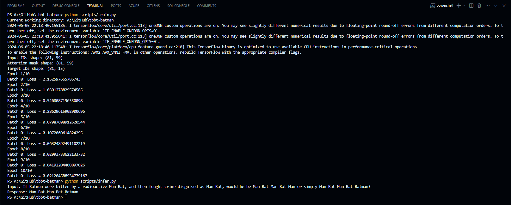

# Can NLP and KR Solve Sheldon's Riddle?

## Project Overview

This project consists of two main scripts:
1. `train.py`: For training the model on custom dialogue datasets.
2. `infer.py`: For generating responses using the trained model.

## Setup Instructions

### Prerequisites

- Python 3.7 or later
- PyTorch
- Transformers library by Hugging Face
- Git

### Installation

1. Clone the repository.
2. Create a virtual environment and activate it.
3. Install the required packages, by using `pip install -r requirements.txt`

### Model and Tokenizer

Ensure you have the pre-trained Google's t5 model and tokenizer saved in the `models` directory:
- `models/t5_model`
- `models/t5_tokenizer`

If not, use the train command to train and save the models.

## Output

## Usage

### Training

To train the model, use the `train.py` script. Ensure your training data is properly preprocessed and available.

### Inference

To generate responses using the trained model, use the `infer.py` script.

## Training

The `train.py` script is used to train the model with custom dialogue datasets. Here's a breakdown of the script:

1. **Data Preprocessing**: Tokenizes the input and target texts. Pads the sequences to the maximum length.
2. **Training Loop**: Uses the `torch` library to train the model. Saves the trained model and tokenizer.

## Inference

The `infer.py` script is used to generate responses based on the input text. Here's how it works:

1. **Model and Tokenizer Loading**: Loads the trained model and tokenizer from the `models` directory.
2. **Generate Response Function**: Encodes the input text. Generates the response using the model. Decodes and returns the response.

## Contributing

Contributions are welcome! If you'd like to contribute to this project, please follow these steps:

1. Fork the repository.
2. Create a new branch (`git checkout -b feature-branch`).
3. Commit your changes (`git commit -m 'Add some feature'`).
4. Push to the branch (`git push origin feature-branch`).
5. Open a Pull Request.

## License

This project is licensed under the MIT License. See the [LICENSE](LICENSE) file for details.

## What next?

I will be improving this project.

## Where to contact ?

Contact: [contact@adityaseth.in](mailto:contact@adityaseth.in?subject=Email%20owing%20to%20adityaseth.in&body=Greetings%2C%0AI%20am%20%5Bname%5D.%20I%20just%20came%20across%20your%20website%20and%20was%20hoping%20to%20talk%20to%20you%20about%20something.)

## 🙋‍♂️ Support

💙 If you like this project, give it a ⭐ and share it with friends!   

---

# Made with  and 
